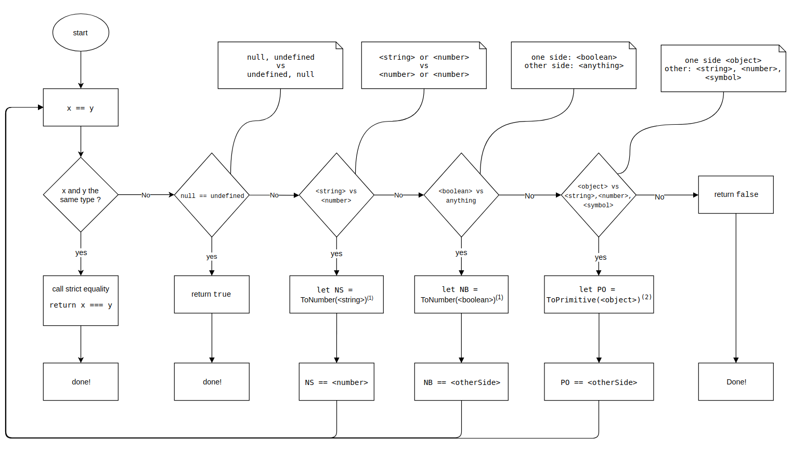

import { Head, Code, Appear, components as Components } from 'mdx-deck'
import { FullscreenCode, Split, SplitRight } from 'mdx-deck/layouts'
import ImageWithLabel from './components/image-with-label'

export { default as theme } from './theme'

<Head>
  <title>JavaScript dla dzidziusów</title>
</Head>

# JavaScript dla dzidziusów vol.1


<ImageWithLabel>
  
</ImageWithLabel>
Author: Artem Ovcharenko

---

## Tag `<script/>`

---
```
<!DOCTYPE HTML>
<html>
    <head>
        <meta charset="utf-8">
        <script>
          1 codu
          ~~~
          40k linijka
        </script>
    </head>
    <body>
      <div>"M jak Miłość", odcinek 1427: Pierwsze spotkanie Sonii i Rafała.</div>
      <div>Ewa Minge opuszcza studio TVP z kocim towarzyszem w kieszeni (ZDJĘCIA)</div>
      <div>Żona Glika urodziła córkę! (Z OSTATNIEJ CHWILI)</div>
    </body>
</html>
```

---

```
<!DOCTYPE HTML>
<html>
    <head>
        <meta charset="utf-8">
    </head>
    <body>
      <div>"M jak Miłość", odcinek 1427: Pierwsze spotkanie Sonii i Rafała.</div>
      <div>Ewa Minge opuszcza studio TVP z kocim towarzyszem w kieszeni (ZDJĘCIA)</div>
      <script>
        1 codu
        ~~~
        40k linijka
      </script>
      <div>Nowe zdjęcia Ratajkowski w reklamie kostiumów kąpielowych</div>
    </body>
</html>
```

---

```
<!DOCTYPE HTML>
<html>
    <head>
        <meta charset="utf-8">
        <script src="path-to-minified-more-efficient-script"/>
    </head>
    <body>
      <div>"M jak Miłość", odcinek 1427: Pierwsze spotkanie Sonii i Rafała.</div>
      <div>Ewa Minge opuszcza studio TVP z kocim towarzyszem w kieszeni (ZDJĘCIA)</div>
      <div>Nowe zdjęcia Ratajkowski w reklamie kostiumów kąpielowych</div>
    </body>
</html>
```

---


```
<!DOCTYPE HTML>
<html>
    <head>
        <meta charset="utf-8">
        <script src="path-to-first-minified-more-efficient-script"/>
        <script src="path-to-second-minified-more-efficient-script">
            //some code
        </script>
    </head>
    <body>
      <div>"M jak Miłość", odcinek 1427: Pierwsze spotkanie Sonii i Rafała.</div>
      <div>Ewa Minge opuszcza studio TVP z kocim towarzyszem w kieszeni (ZDJĘCIA)</div>
      <div>Nowe zdjęcia Ratajkowski w reklamie kostiumów kąpielowych</div>
    </body>
</html>
```
---

## Attributes `async`, `defer`

---

```
...
    const समारोह = (परिणाम) => परिणाम;
...
    var परिवर्तनशील = समारोह();
...
    let temporaryResult = परिवर्तनशील * Math.rand();
```
---

## `var`, `let`, `const`

---

```
    console.log($);  //undefined

    var $ = 'dollar';

    console.log($); // 'dollar'
```

---


```
    var $;

    console.log($);  //undefined

    $ = 'dollar';

    console.log($); // 'dollar'
```

---

```
function getDollar(earned) {
    // $ exists here with a value of undefined

    console.log($); // undefined
    if (earned) {
        var $ = 'dollar';
        console.log($); // 'dollar';
    }

    return $;
}
```
---

```
    console.log($);  //error, no code bellow :'C

    let $ = 'dollar';

    console.log($);
```
---

```
    function getMoney(earned) {
        // money doesn't exist here
        // console.log(money); => ReferenceError: money is not defined
        let money = 0;
        if (true) {
            let money = 100;
        }

        return money; // 0
    }

```

---

```
    let name = 'name';
    let name = ' not a name' // Identifier 'name' has already been declared

```

---

```
    // VIP module for Zbigniew only
    (function () {
        name = 'Zbigniew' // const or var missed here
        //smth smth;
    })();


    // VIP module for Błażej only
    (function() {
        if (!name) {
            name = 'Błażej';
        }

        console.log(name); // 'Zbigniew' :'C
    })()

```

---

## Task 1.

1. Write a function `createArmy`, which will create army - array of 'solders'(array of functions).
2. Each solder can say his position in array(alert(position))

```
const createArmy = (number) => [function*number]
const army = createArmy(number);

const fifthSolder = army(5);

fifthSolder() // alert(5)
```

---

## Variable's name cant:

1. Starts from number. (100$)
2. Contains dash. (varia-ble)
3. Be reserved word: `return`, `class`, `export` etc.
---


```
    const $ = '$';
    ...
    if (2 * $ == donation) {
        //smth
    }
```

---

<ImageWithLabel>
  
</ImageWithLabel>

---

## Basic javaScript data types:

1. Primitives(instance has one value):
    - number (`5.0`, `Infinity`, `NaN`)
    - string (`''`, `swag`)
    - boolean (`true`, `false`)
    - null
    - undefined
2. Complex(instance can contains data collection) - object:
    - object/array (`{ zuch: 'Mateusz' }`, `{}`, `[]`, `['pierszy zuch', 'drugi zuch']`)
    - function
---

## `typeof`

```
    typeof undefined // "undefined"

    typeof 0 // "number"

    typeof true // "boolean"

    typeof "foo" // "string"

    typeof {} // "object"

    typeof [] // "object"

    typeof null // "object"

    typeof function(){} // "function"

```
---

## Type Conversions

1. Explicit
2. Implicit

---

## Explicit

1. Conversion to number
    - Number(smth)
    - parseInt/parseFloat - use for 'string like a number' conversion
2. Conversion to string
    - String(smth)
    - toString - every instance created by constructor has it
3. Conversion to boolean
    - Boolean(smth)
---

## Implicit

1. Conversion to number
    - unary `+`  (+'2' === 2 // true)
2. Convertion to boolean
    - !! (!!1 === true // true)
3. convertion to string
    - `+ ''` ((1 + '1') === '11' // true)

---

```
 5 + null   // returns 5         because null is converted to 0
"5" + null  // returns "5null"   because null is converted to "null"
"5" + 2     // returns "52"      because 2 is converted to "2"
"5" - 2     // returns 3         because "5" is converted to 5
"5" * "2"   // returns 10        because "5" and "2" are converted to 5 and 2
```

---

---

<ImageWithLabel>
  
</ImageWithLabel>

---


## Questions

---

### Thank you for your participation.
